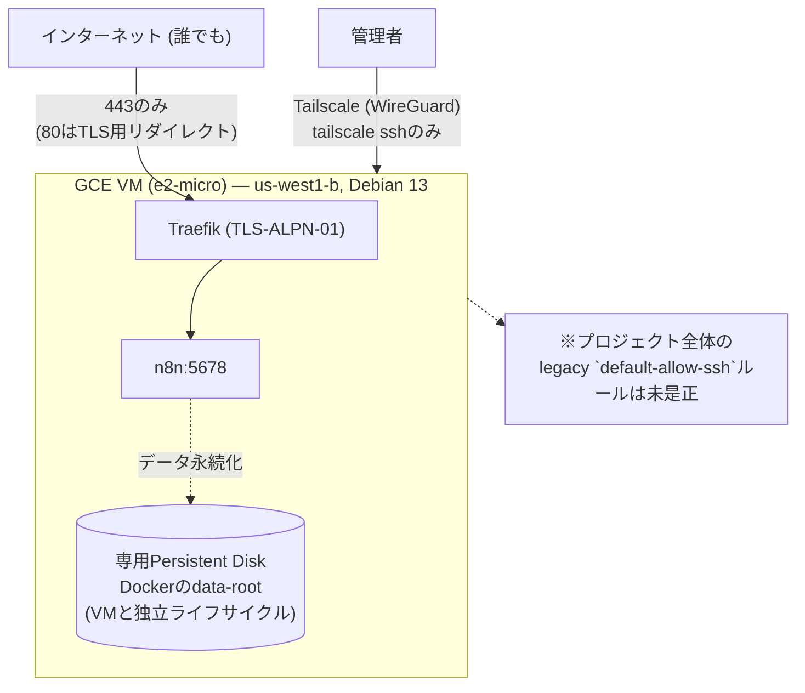

# n8n-ops

自分用のn8n(ワークフロー自動化)を、GCP Compute Engine(us-west1)上でセルフホスティングするためのインフラ一式。TerraformでGCPリソースを、GitHub ActionsでCI/CDを、Tailscaleで管理系アクセスを保護する。姉妹プロジェクト[vaultwarden-ops](https://github.com/kuchida1981/vaultwarden-ops)と同じ構成パターンを踏襲している。

- 公開URL: `https://n8n.u-rei.com`
- SSHは`tailscale ssh`経由のみを正規経路とする(ただしGCPプロジェクトに残る legacy な`default-allow-ssh`ルールの是正は本リポジトリのスコープ外。ロードマップ参照)
- n8nの`/alive`監視ワークフローがvaultwardenの死活監視を担っており、n8n自身のデータ移行はこのワークフローの継続性に直結する
- データ永続化: 専用Persistent Disk上にDockerの`data-root`ごと配置し、named volume(`n8n_data`/`traefik_data`)をVMのライフサイクルから独立させる
- n8nイメージはリテラルタグで固定し、Dependabotが新バージョンを検知して更新PRを作成する
- バージョン更新の本番反映は`n8n-deploy.yml`(GitHub Environment承認ゲート付き)経由でのみ行われ、PRマージだけでは自動反映されない(詳細は「n8nのバージョン更新」参照)

## アーキテクチャ



Terraformは`terraform/bootstrap`(1回だけ手動apply)と`terraform/main`(GitHub Actionsが継続的にapply)の2段構成。

## vaultwarden-opsとの相違点

同じtailnet・同じGCPプロジェクト(`kuchida-devel`)を共有しているため、以下の点で単純な複製ではなく調整が入っている:

- **リージョン**: vaultwardenはasia-northeast1だが、n8nはus-west1のまま。GCP Compute Engine常時無料枠のe2-microはus-west1/us-central1/us-east1限定のため、この制約を維持している
- **リバースプロキシ**: vaultwardenはCaddyだが、n8nはTraefik(n8n公式サンプルの構成をそのまま踏襲したいため)
- **データ永続化の実装**: vaultwardenはdocker-compose.ymlをbind mountに書き換えているが、n8nはnamed volumeの構造を変えず、Dockerの`data-root`自体を専用ディスクへ向けている(理由は`n8n/docker-compose.yml`と`terraform/main/disk.tf`のコメント参照)
- **Tailscale ACL**: `tailscale_acl`リソースはtailnetの全ポリシーを単一リソースとして上書き管理するため、n8n-opsとvaultwarden-ops、2つの独立したTerraform stateが同じtailnetを管理する形になっている。`terraform/main/tailscale.tf`は両リポジトリのタグ・ACLエントリを合成した内容として書かれており、どちらか一方だけをapplyすると他方の設定を消してしまうリスクがある。**このリポジトリのtailscale.tfをapplyする前には、必ずvaultwarden-ops側の現行ACL内容と照合すること**

## セットアップ手順

### 0. 前提

- GCPプロジェクトが作成済みで、課金が有効化されていること(vaultwarden-opsと同じプロジェクトを想定)
- ローカルに`gcloud` CLIと`terraform`(>=1.6)がインストール済みで、`gcloud auth application-default login`済みであること
- Tailscaleのtailnetに参加済みであること(vaultwarden-opsが既に使っているtailnetを再利用する)

### 1. Bootstrap(手動・最初の1回だけ)

`terraform/main`はGCSのリモートバックエンドとWorkload Identity Federation経由のGitHub Actions認証を前提にしているが、そのバケットとWIF Pool自体は「これから作る側」なので、ローカルから一度だけ手動で作成する。

```bash
cd terraform/bootstrap
terraform init
terraform apply \
  -var="project_id=<your-gcp-project-id>" \
  -var="github_repo=<your-github-username>/<your-repo-name>"  # must exactly match the GitHub repo, e.g. kuchida1981/n8n-ops
```

apply完了後、以下のoutputを控える(次のGitHub Secrets登録で使う):

```bash
terraform output
# state_bucket
# workload_identity_provider
# terraform_ci_service_account_email
```

**既存環境をアップデートする場合**: `terraform/bootstrap`はGitHub Actionsではなく手動apply専用のため、CI用サービスアカウントのIAM権限(例: `n8n-deploy.yml`用に追加した`roles/iap.tunnelResourceAccessor`・`roles/compute.osAdminLogin`)が変更されたときは、同じ`terraform apply`コマンドを再実行して反映させる必要がある。差分のみが適用され、既存リソースは壊れない。

### 2. Tailscale OAuthクライアントの発行(手動、またはvaultwarden-opsのものを再利用)

vaultwarden-opsで既にTerraformプロバイダ用のOAuthクライアント(Policy File + Auth Keysスコープ)を発行済みなら、それをそのまま再利用できる。新規発行が必要な場合は、vaultwarden-opsのREADME「2. Tailscale OAuthクライアントの発行」の手順に倣い、Auth Keysのタグには`tag:n8n-server`を追加で選択する。

いずれの場合も、apply前に https://login.tailscale.com/admin/acl/file で現在のACL(vaultwarden-opsが管理する`tag:vaultwarden-server`関連の設定を含む)を確認し、`terraform/main/tailscale.tf`の内容と一致しているか照合すること。

### 3. GitHub Actions Secretsの登録

このリポジトリの Settings → Secrets and variables → Actions に、以下を登録する:

| Secret名 | 値 |
|---|---|
| `GCP_PROJECT_ID` | GCPプロジェクトID |
| `GCP_WORKLOAD_IDENTITY_PROVIDER` | bootstrapのoutput `workload_identity_provider` |
| `GCP_SERVICE_ACCOUNT_EMAIL` | bootstrapのoutput `terraform_ci_service_account_email` |
| `TF_STATE_BUCKET` | bootstrapのoutput `state_bucket` |
| `TAILSCALE_OAUTH_CLIENT_ID` | 手順2で発行(または再利用)したClient ID |
| `TAILSCALE_OAUTH_CLIENT_SECRET` | 手順2で発行(または再利用)したClient Secret |
| `TAILSCALE_TAILNET` | 自分のtailnet名 |

**重要**: これらはリポジトリにコミットしない。すべてGitHub Actions Secretsとしてのみ保持する(このリポジトリは公開リポジトリなので特に注意)。

### 4. GitHub Environmentの承認ゲート設定(手動)

`terraform-apply.yml`ワークフローは`environment: production`を参照しているが、実際に人間の承認待ちで停止させるprotection ruleはワークフローYAMLだけでは設定できない。このリポジトリの Settings → Environments → New environment で `production` を作成し、"Required reviewers" に自分自身(または信頼できるレビュワー)を追加する。

### 5. Phase A: テストサブドメインでの初回apply

`terraform/main/variables.tf`の`domain`変数はデフォルトで`n8n-test.u-rei.com`を指すようになっている。`main`ブランチへのマージ後、GitHub Actionsの`terraform apply`ワークフローが承認待ちで停止するので、GitHub上で承認する。初回applyでVM・静的IP・ファイアウォール・データディスク・Secret Manager・Tailscale ACL/認証キーが一括作成される。

apply完了後、出力された静的External IPを使い、`u-rei.com`のDNS管理画面で`n8n-test.u-rei.com`のAレコードを手動作成する。

以下を確認する:
- `https://n8n-test.u-rei.com`でLet's Encrypt証明書が有効になっており、n8nの初期セットアップ画面が表示される
- `tailscale ssh n8n`でVMに接続できる
- `free -h`/`swapon --show`でswapが有効
- VM再起動後もstartup-scriptの再実行で二重処理が起きない

### 6. Phase B〜E: 本番データ移行とカットオーバー

Phase Aの検証が済んでから着手する。ダウンタイムは許容する前提。

1. 旧VM(`n8n-debian`, us-west1-b)で`docker compose down`
2. 旧VMの`n8n_data`ボリューム配下全体(`config`, `database.sqlite`, `binaryData/`, `nodes/`, `ssh/`, `storage/`等)をtailscale経由のrsync/scpで新VMのDocker data-root配下へコピー
3. 新VM上で`docker compose down && docker compose up -d`し、コピーしたデータでn8nが起動することを確認
4. n8nエディタで既存ワークフロー・credentialsが表示されること(encryptionKeyが正しく引き継がれている証拠)を確認
5. `terraform/main/variables.tf`の`domain`のデフォルト値を`n8n.u-rei.com`に変更してPR→承認→apply
6. `n8n.u-rei.com`向けの新しいTLS証明書が発行されるのを待ち、DNSのAレコードを新VMの静的IPへ切り替える
7. vaultwardenの`/alive`監視ワークフローが正常にDiscord通知を送れることを確認する
8. 問題がなければ旧VM(`n8n-debian`)とそのディスクを削除する

## n8nのバージョン更新

n8nイメージは`n8n/docker-compose.yml`でリテラルタグ固定しており、更新は以下の2段階の承認を経て反映される。即時反映は意図しておらず、月1回程度の更新頻度を想定している。

1. **バージョンを受け入れる**: Dependabotがn8nの新バージョンを検知すると、`n8n/docker-compose.yml`のタグ更新を提案するPRを自動作成する(n8nイメージは`n8nio/n8n`という暗黙のDocker Hub参照で記述しており、Dependabotが認証情報なしで検知できる。`docker.n8n.io`独自レジストリを直接参照する構成は、Dependabotの`docker-registry`タイプが`username`/`password`を必須とするため採用していない)。PRをレビューし、`main`へマージする
2. **今このタイミングで反映する**: マージをトリガーに`n8n-deploy.yml`が起動し、`production` Environmentの承認待ちで一時停止する。承認すると、CIランナーがGCP IAP tunnel経由でVMへSSHし、`git pull && docker compose pull && docker compose up -d`を実行する。VM自体の再起動は行わないため、Traefikの証明書(`acme.json`)には影響しない

反映後は、対象のn8nバージョンで実際にワークフローが動作していること(vaultwardenの`/alive`監視ワークフロー含む)を確認する。

## ロードマップ(本リポジトリの現時点のスコープ外)

- NASへの自動バックアップ(vaultwarden-opsの`add-nas-backup`パターンをn8n向けに展開する、次の別change)
- GCPプロジェクト全体に効いている legacy な`default-allow-ssh`/`default-allow-rdp`ファイアウォールルールの是正(vaultwarden VMにも影響する既知の問題)
- リバースプロキシのCaddyへの統一(Traefikの現状維持を優先しているが、将来検討)

## ディレクトリ構成

```
terraform/bootstrap/  … 手動・1回だけapply。GCS state bucket, WIF Pool, CI用SA
terraform/main/       … GitHub Actionsが継続的にapply。VM/FW/Disk/Secret Manager/Tailscale ACL
n8n/                   … docker-compose.yml(Traefik + n8n)
.github/workflows/     … terraform plan(PR) / apply(main, 承認ゲート付き) / n8n-deploy(n8n/配下の変更、承認ゲート付き)
```
