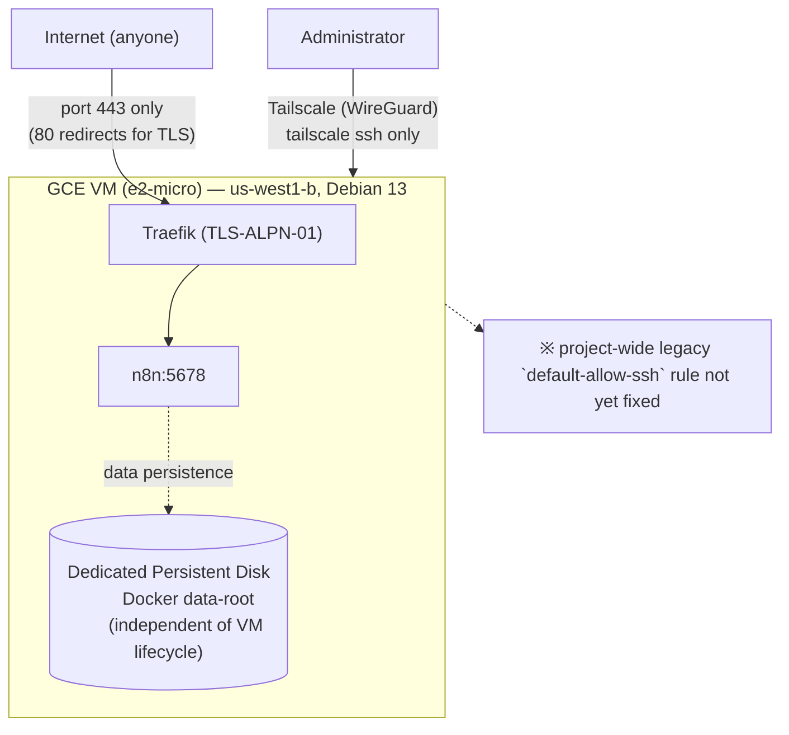

# n8n-ops

[日本語](README.ja.md)

Infrastructure for self-hosting a personal instance of n8n (workflow automation) on GCP Compute Engine (us-west1). Terraform manages the GCP resources, GitHub Actions handles CI/CD, and Tailscale protects administrative access. This repo follows the same structural pattern as its sister project [vaultwarden-ops](https://github.com/kuchida1981/vaultwarden-ops).

- Public URL: `https://n8n.u-rei.com`
- `tailscale ssh` is the only sanctioned SSH path (fixing the legacy `default-allow-ssh` rule that still lingers in the GCP project is out of scope for this repo — see Roadmap)
- n8n's `/alive` monitoring workflow is what keeps watch over vaultwarden's liveness, so n8n's own data migration directly affects the continuity of that workflow
- Data persistence: Docker's entire `data-root` lives on a dedicated Persistent Disk, keeping the named volumes (`n8n_data`/`traefik_data`) independent of the VM's lifecycle
- The n8n image is pinned to a literal tag; Dependabot detects new versions and opens update PRs
- Rolling a version update into production happens exclusively through `n8n-deploy.yml` (gated by a GitHub Environment approval) — merging the PR alone does not deploy it (see "Updating the n8n version" for details)

## Architecture



Terraform is split into two stages: `terraform/bootstrap` (manual apply, once) and `terraform/main` (applied continuously by GitHub Actions).

## Differences from vaultwarden-ops

Because both projects share the same tailnet and the same GCP project (`kuchida-devel`), this isn't a straight copy — a few things are deliberately adjusted:

- **Region**: vaultwarden runs in asia-northeast1, but n8n stays in us-west1. The GCE always-free e2-micro tier is limited to us-west1/us-central1/us-east1, so this constraint is preserved as-is
- **Reverse proxy**: vaultwarden uses Caddy, but n8n uses Traefik (to stay close to n8n's official sample configuration)
- **Data persistence implementation**: vaultwarden rewrites `docker-compose.yml` to use bind mounts, while n8n keeps the named-volume structure unchanged and instead points Docker's `data-root` itself at the dedicated disk (see the comments in `n8n/docker-compose.yml` and `terraform/main/disk.tf` for the reasoning)
- **Tailscale ACL**: the `tailscale_acl` resource overwrites the entire tailnet policy as a single resource, so if two independent Terraform states both held it, whichever applied last would wipe out the other's config. To structurally prevent that, **vaultwarden-ops' `terraform/main/tailscale.tf` is the sole owner of the ACL policy, and n8n-ops does not hold a `tailscale_acl` resource at all** (the `tag:n8n-server` tagOwners and SSH rules are also managed on the vaultwarden-ops side). n8n-ops only manages the `tailscale_tailnet_key` (auth key). When adding a new service to the tailnet, add its tag to vaultwarden-ops' `tailscale.tf`, not to the new service's own repo

## Setup

### 0. Prerequisites

- A GCP project already exists with billing enabled (assumed to be the same project as vaultwarden-ops)
- `gcloud` CLI and `terraform` (>=1.6) are installed locally, and `gcloud auth application-default login` has been run
- You're already a member of the Tailscale tailnet (reusing the tailnet vaultwarden-ops already uses)

### 1. Bootstrap (manual, once)

`terraform/main` assumes a GCS remote backend and GitHub Actions authentication via Workload Identity Federation, but the bucket and WIF Pool themselves are what's "about to be created," so they're set up manually from your local machine, once. `terraform/bootstrap` itself also keeps its own state in that same bucket (under a separate `bootstrap` prefix, configured in `terraform/bootstrap/versions.tf`), rather than a local file, so its state isn't tied to whichever machine last ran `apply` and isn't at risk of being lost when you switch machines.

**If the state bucket already exists in this project** (the common case — re-running bootstrap on an already-bootstrapped environment, e.g. to pick up an IAM change):

```bash
cd terraform/bootstrap
terraform init -backend-config="bucket=<existing-state-bucket-name>"
terraform apply \
  -var="project_id=<your-gcp-project-id>" \
  -var="github_repo=<your-github-username>/<your-repo-name>"  # must exactly match the GitHub repo, e.g. kuchida1981/n8n-ops
```

**If this is the very first bootstrap run in a brand new GCP project** (the bucket doesn't exist yet, so `terraform init` has nothing to point the backend at), do a one-time local-then-migrate dance instead:

```bash
cd terraform/bootstrap

# 1. Temporarily comment out the `backend "gcs" { ... }` block in versions.tf
#    so this first-ever run can use local state to create the bucket itself.
terraform init
terraform apply \
  -var="project_id=<your-gcp-project-id>" \
  -var="github_repo=<your-github-username>/<your-repo-name>"

# 2. Restore the `backend "gcs" { ... }` block, then migrate the state you
#    just created into the bucket that same apply just created.
terraform init -backend-config="bucket=$(terraform output -raw state_bucket)" -migrate-state
```

After either path, note the following outputs (you'll need them when registering GitHub Secrets):

```bash
terraform output
# state_bucket
# workload_identity_provider
# terraform_ci_service_account_email
```

**Updating an existing environment**: Since `terraform/bootstrap` is manual-apply-only (not run by GitHub Actions), if the CI service account's IAM permissions change (e.g. `roles/iap.tunnelResourceAccessor` / `roles/compute.osAdminLogin` added for `n8n-deploy.yml`), you need to re-run the same `terraform apply` command to pick up the change. Only the diff is applied; existing resources are untouched. Because state now lives in GCS, this can be done from any machine — just run `terraform init -backend-config="bucket=<state_bucket>"` first to reconnect to the shared state; there's no need to be on the machine that last applied it.

### 2. Issue a Tailscale OAuth client (manual, or reuse vaultwarden-ops')

If you've already issued an OAuth client for the Terraform provider in vaultwarden-ops (with Policy File + Auth Keys scopes), you can reuse it as-is. If you need to issue a new one, follow the steps in vaultwarden-ops' README under "2. Issue a Tailscale OAuth client," additionally selecting `tag:n8n-server` for the Auth Keys tag.

Either way, before applying, check the current ACL at https://login.tailscale.com/admin/acl/file and confirm that vaultwarden-ops' `terraform/main/tailscale.tf` (the sole owner of this tailnet's ACL policy) already includes the `tag:n8n-server` tagOwners and SSH rules. If it doesn't, add and apply that entry on the vaultwarden-ops side first, before proceeding to apply this repo.

### 3. Register GitHub Actions Secrets

In this repo's Settings → Secrets and variables → Actions, register the following:

| Secret name | Value |
|---|---|
| `GCP_PROJECT_ID` | GCP project ID |
| `GCP_WORKLOAD_IDENTITY_PROVIDER` | bootstrap output `workload_identity_provider` |
| `GCP_SERVICE_ACCOUNT_EMAIL` | bootstrap output `terraform_ci_service_account_email` |
| `TF_STATE_BUCKET` | bootstrap output `state_bucket` |
| `TAILSCALE_OAUTH_CLIENT_ID` | Client ID issued (or reused) in step 2 |
| `TAILSCALE_OAUTH_CLIENT_SECRET` | Client Secret issued (or reused) in step 2 |
| `TAILSCALE_TAILNET` | Your tailnet name |

**Important**: Never commit these to the repo. Keep them exclusively as GitHub Actions Secrets (this repo is public, so be especially careful).

### 4. Configure the GitHub Environment approval gate (manual)

The `terraform-apply.yml` workflow references `environment: production`, but the protection rule that actually pauses it for human approval can't be set via workflow YAML alone. In this repo's Settings → Environments → New environment, create `production` and add yourself (or a trusted reviewer) as a "Required reviewer."

### 5. Phase A: First apply against the test subdomain

`terraform/main/variables.tf`'s `domain` variable defaults to `n8n-test.u-rei.com`. After merging to `main`, the GitHub Actions `terraform apply` workflow will pause waiting for approval — approve it on GitHub. The first apply creates the VM, static IP, firewall, data disk, Secret Manager, and Tailscale auth key all at once (the ACL policy itself must already be managed on the vaultwarden-ops side — see step 2).

After the apply completes, use the static external IP it outputs to manually create an A record for `n8n-test.u-rei.com` in `u-rei.com`'s DNS management.

Verify the following:
- `https://n8n-test.u-rei.com` has a valid Let's Encrypt certificate and shows n8n's initial setup screen
- You can connect to the VM with `tailscale ssh n8n`
- Swap is active, per `free -h`/`swapon --show`
- Rebooting the VM doesn't cause the startup-script to double-run

### 6. Phase B–E: Production data migration and cutover

Start this once Phase A is verified. Downtime is acceptable.

1. On the old VM (`n8n-debian`, us-west1-b), run `docker compose down`
2. Copy everything under the old VM's `n8n_data` volume (`config`, `database.sqlite`, `binaryData/`, `nodes/`, `ssh/`, `storage/`, etc.) to the new VM's Docker data-root, via rsync/scp over tailscale
3. On the new VM, run `docker compose down && docker compose up -d` and confirm n8n starts with the copied data
4. In the n8n editor, confirm existing workflows and credentials appear (proof that the encryptionKey carried over correctly)
5. Change `terraform/main/variables.tf`'s `domain` default to `n8n.u-rei.com`, then PR → approve → apply
6. Wait for the new TLS certificate for `n8n.u-rei.com` to be issued, then switch the DNS A record to the new VM's static IP
7. Confirm vaultwarden's `/alive` monitoring workflow can still successfully send Discord notifications
8. Once confirmed, delete the old VM (`n8n-debian`) and its disk

## Updating the n8n version

The n8n image is pinned to a literal tag in `n8n/docker-compose.yml`; updates go through two approval stages before taking effect. Immediate rollout isn't the intent — this assumes roughly a monthly update cadence.

1. **Accepting a version**: When Dependabot detects a new n8n version, it opens a PR proposing a tag update in `n8n/docker-compose.yml` (the image is referenced as the implicit `n8nio/n8n` Docker Hub reference, which Dependabot can detect without credentials; referencing the `docker.n8n.io` registry directly wasn't adopted because Dependabot's `docker-registry` type requires `username`/`password`). Review the PR and merge it into `main`
2. **Rolling it out now**: The merge triggers `n8n-deploy.yml`, which pauses waiting for approval on the `production` Environment. Once approved, the CI runner SSHes into the VM over a GCP IAP tunnel and runs `git pull && docker compose pull && docker compose up -d`. The VM itself is not rebooted, so Traefik's certificate (`acme.json`) is unaffected

After rollout, confirm workflows are actually running on the new n8n version (including vaultwarden's `/alive` monitoring workflow).

## Roadmap (currently out of scope for this repo)

- Automated backups to NAS (extending vaultwarden-ops' `add-nas-backup` pattern to n8n, as a separate future change)
- Fixing the legacy `default-allow-ssh`/`default-allow-rdp` firewall rules that apply project-wide (a known issue that also affects the vaultwarden VM)
- Unifying the reverse proxy on Caddy (Traefik is kept as-is for now, but under consideration for the future)

## Directory structure

```
terraform/bootstrap/  … manual, apply once. GCS state bucket, WIF Pool, CI service account
terraform/main/       … applied continuously by GitHub Actions. VM/FW/Disk/Secret Manager/Tailscale auth key (the ACL policy itself is solely owned by vaultwarden-ops)
n8n/                   … docker-compose.yml (Traefik + n8n)
.github/workflows/     … terraform plan (PR) / apply (main, approval-gated) / n8n-deploy (changes under n8n/, approval-gated)
```
